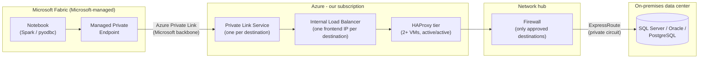

# Fabric Private Connectivity Platform

> **A real-world reference architecture, sanitized for teaching.**
> This is a working pattern a university IT team is deploying to let Microsoft Fabric notebooks reach on-premises databases privately. Names, IPs, and identifiers have been replaced with placeholders (`contoso`, `example.edu`, `10.x.x.x`). The design is real. It is also a work in progress, and today's best practice may not be tomorrow's.

---

## The problem

Data engineers write Spark notebooks in **Microsoft Fabric**, a SaaS analytics platform that Microsoft runs. Some of the data they need lives in databases **on-premises**: SQL Server, Oracle, and PostgreSQL in the university data center.

Those databases are not on the internet, and they shouldn't be. So how does a notebook running in Microsoft's cloud reach a database in our basement **without**:

- opening a firewall hole to the internet,
- giving Fabric a route into the whole campus network, or
- hand-building a one-off tunnel every time someone needs a new database?

The last point matters as much as the first two. A secure solution that takes five people and three weeks to extend for every new database will be bypassed. We want a **paved road**: the secure way should also be the easy way.

## The main idea

**Fabric can only reach things through a private endpoint, so we publish each approved database as a private "service" inside Azure, and a small proxy tier forwards that traffic over our private connection to the data center.**

## How the traffic flows



**Step by step:**

| # | What happens | Why it's built this way |
|---|---|---|
| 1 | A notebook connects to `sqlprod01.ad.example.edu:1433`. Inside the workspace's **managed virtual network**, that name resolves to a **Managed Private Endpoint (MPE)**. | Fabric Spark can't see our network directly. An MPE is the only supported "door" out of the workspace's private network. |
| 2 | The MPE connects through Azure Private Link to a **Private Link Service (PLS)** we own. | Private Link connects two networks that don't trust each other. It allows *one service* to be reached, not a whole network. |
| 3 | The PLS hands traffic to an **Internal Load Balancer (ILB)** frontend. | A PLS can only sit in front of a Standard Internal Load Balancer. That's an Azure rule, not our choice. |
| 4 | The ILB sends traffic to the **HAProxy** VMs, which forward it to the real database. | A load balancer can't send traffic to an on-prem IP address. Something inside our VNet has to make the next hop. That's the proxy's whole job. |
| 5 | Traffic goes through the **firewall** in the network hub and over **ExpressRoute** to the data center. | The firewall is the second lock: even if the proxy were misconfigured, it can only reach destinations we approved. |

### Ask yourself: why does every box exist?

A good architecture review asks "what breaks if I remove this?" for every component. Try it here:

- **Remove the MPE?** Fabric has no private way out. You'd need public endpoints.
- **Remove the PLS?** The MPE has nothing to connect to.
- **Remove the ILB?** The PLS has no supported target.
- **Remove HAProxy?** The ILB can't reach on-prem IPs.
- **Remove the firewall?** A proxy config mistake could expose anything reachable over ExpressRoute.

If you can't answer "what breaks," the box probably shouldn't be there.

## How it maps to the Well-Architected Framework

| Pillar | How this design addresses it | Where it's still weak (be honest) |
|---|---|---|
| **Security** | No public endpoints. One PLS per destination limits blast radius. MPE connections need manual approval. The firewall allowlists destinations. Database credentials never live on the proxy. | The database sees the proxy's IP address, not which workspace connected. Accountability depends on per-workspace database logins. |
| **Reliability** | 2+ HAProxy VMs across availability zones behind a load balancer with health probes. | ExpressRoute is a single path unless a VPN failover is configured. The on-prem database is still a single point of failure we don't control. |
| **Operational Excellence** | Everything is Infrastructure as Code. **One registry file drives every change** (see below). | Proxy VMs need OS patching. That's real operational work SaaS would avoid. |
| **Cost Optimization** | Small VMs and a shared tier for all destinations. Load balancer and Private Link are cheap compared with dedicated gateways. | Managed VNet workspaces lose Fabric "starter pools," so Spark sessions take a few minutes longer to start. Time is a cost too. |
| **Performance Efficiency** | TCP pass-through: no TLS termination or inspection on the proxy, so overhead is minimal. | Large data pulls are bound by ExpressRoute bandwidth and the source database. |

## The paved road: one file drives everything

This is the part we care most about operationally. Adding a new database to this platform used to mean touching a load balancer, a Private Link Service, the proxy config, the firewall, DNS, and Fabric, each by hand and often by different people.

Instead, **every approved destination is one entry in a registry file**:

```yaml
# destinations.example.yaml
# One entry = one approved destination. Adding a database is a pull request to this file.
# The pipeline generates everything else from it: ILB frontend + rule, PLS,
# HAProxy listener, firewall rule, and the FQDN list for the Fabric MPE.

destinations:
  - name: sqlprod01                       # short name; used in every resource name
    fqdn: sqlprod01.ad.example.edu        # the REAL server name, so TLS certificates still validate
    targetIp: 10.20.30.40                 # on-prem address the proxy forwards to
    port: 1433                            # the port the client uses (stays standard)
    proxyPort: 10001                      # unique port HAProxy listens on internally
    engine: sqlserver
    dataClassification: restricted        # drives who can approve access
    owner: data-platform-team
    ticket: REQ-0001                      # the approved request that authorized this entry

  - name: oraprod01
    fqdn: oraprod01.ad.example.edu
    targetIp: 10.20.30.50
    port: 1521
    proxyPort: 10002
    engine: oracle
    dataClassification: internal
    owner: data-platform-team
    ticket: REQ-0002
```

A change to this file goes through a pull request (review), then the pipeline (automation), then a deployment record (traceability). Nobody logs into the portal.

From that one entry, `scripts/render.py` generates:

| Generated | Becomes |
|---|---|
| `out/destinations.json` | Bicep input: ILB frontend + rule, Private Link Service, NSG allow rules |
| `out/haproxy.cfg` | The listener on every proxy VM (pushed one VM at a time, validated before reload) |
| `out/firewall-allowlist.json` | The exact request for the hub firewall owner |

A second file, `workspaces.yaml`, says which Fabric workspaces may reach which destinations. The pipeline creates those managed private endpoints and approves only the ones it can trace to a ticket, after a human reviews the list.

**Why the port trick?** Each destination gets its own ILB frontend IP *and* its own PLS, so the client always uses the standard port (1433) against its own private endpoint. The ILB rule translates `frontend:1433` to `haproxy:10001`, and HAProxy knows that 10001 means `sqlprod01`. Clients never see the internal port.

## How it maps to the Enterprise Architecture Framework

| Framework layer | In this example |
|---|---|
| **Business need** | Data engineers need on-prem data in Fabric notebooks. |
| **Policy / principles** | Restricted data must not traverse the public internet. Least privilege. |
| **Architecture controls** | Private connectivity; network segmentation; controlled egress; auditability. |
| **Standards** | Platform Product Standard: versioned, documented, automated, no secrets in source. |
| **ADRs** | The decisions in the Enterprise Architecture section of help.uark.edu |
| **Pattern** | "Private Link Service + proxy to reach non-Azure endpoints." |
| **Product** | `fabric-private-connectivity`, a **Platform Product**. A destination is a *registry entry* with its own lifecycle (add, change, retire), but not a separate product: it can't deploy without the shared load balancer and proxies. |
| **Deployment** | Our production instance, built from a private parameter file. |
| **Operational evidence** | Load balancer health probes, HAProxy metrics, PLS connection status, firewall logs. |

## Why we build with Azure Verified Modules (AVM)

We don't hand-write every load balancer and VM definition. We compose **Azure Verified Modules**: Microsoft-maintained, tested Bicep and Terraform modules for individual Azure resources.

- **Less code to own.** The load balancer module is Microsoft's to maintain. Our code describes *our* decisions, not boilerplate.
- **Secure defaults.** Modules follow consistent specs for diagnostics, locks, role assignments, and tags.
- **Consistency.** Every team that uses the module gets the same interface.

**The catch, and the lesson:** many AVM modules are still version `0.x`. In semantic versioning, `0.x` means *no stability promise*, so a minor version bump can break you. We pin exact versions and upgrade on purpose, never automatically.

## Public repo vs. private deployment

This repo is public. Our production deployment is not. That split is deliberate, and it's how real platform teams work:

| Lives here (public) | Lives in a private repo |
|---|---|
| The **product**: reusable Bicep that composes AVM modules | The **deployment**: parameter files with real names, IPs, subscription IDs |
| Example parameters with placeholder values | The real `destinations.yaml` |
| Documentation, decisions, diagrams | Pipeline service connections and approvals |

If your code only works with secrets or real IPs baked in, it isn't a reusable product yet.

## What's in this repo

```
fabric-private-connectivity/
├── products/platform/fabric-private-connectivity/
│   ├── main.bicep            # The product: composes AVM modules
│   ├── cloud-init.yaml       # Static proxy baseline (HAProxy + health endpoint)
│   └── README.md             # Product interface, per the Product Standard
├── scripts/
│   ├── render.py             # Registry -> Bicep input + HAProxy config + firewall list
│   ├── push-haproxy-config.sh# Validated, rolling config push via Run Command
│   ├── fabric_mpe.py         # Creates Fabric managed private endpoints
│   ├── approve_pls_connections.py # Approves only ticket-traceable connections
│   └── write_deployment_record.py
├── pipelines/templates/      # Reusable Azure DevOps stages
├── examples/deployment/      # What the PRIVATE deployment repo looks like (fake values)
├── tests/                    # Registry rules, run on every PR
├── docs/
│   ├── decisions.md          # Every major decision, options, pros/cons
│   └── runbook.md            # Deploy, add, onboard, retire, troubleshoot
└── .github/workflows/        # CI: tests, render, haproxy -c, bicep build + lint
```

## Try it locally (no Azure needed)

```bash
pip install pyyaml pytest
python -m pytest -q tests
python scripts/render.py --registry examples/deployment/destinations.yaml \
  --workspaces examples/deployment/workspaces.yaml --out examples/deployment/out
cat examples/deployment/out/haproxy.cfg
```

Then break something on purpose: give two destinations the same `proxyPort`, or a public `targetIp`, and watch validation stop you.

## Using this repo

This is a **template repository**. Click **Use this template** to get your own clean copy (you can make it private). That's different from:

- **Clone**: download a copy to your machine (`git clone ...`).
- **Fork**: a linked copy on GitHub used to propose changes back. Forks of public repos must stay public.

## Things that will cause issues (read before deploying)

1. **TLS names.** Use the database's real FQDN in the MPE, not a made-up alias, or certificate validation fails and someone "fixes" it with `TrustServerCertificate=yes`. Don't.
2. **Protocol redirects.** Oracle RAC/SCAN listeners and SQL Server Availability Group read-only routing redirect clients to *other* hosts and ports, which bypasses the proxy. Test each destination type.
3. **Health probes.** Probe HAProxy's own health endpoint, not the database. Otherwise one database outage can mark every proxy unhealthy.
4. **NSG rules.** Allow the Azure load balancer probe source (`AzureLoadBalancer` service tag) and the PLS NAT subnet into the proxy subnet. Deny everything else.
5. **Slower Spark start.** Workspaces with managed VNets can't use starter pools. Sessions take a few extra minutes to start. Set expectations up front.
6. **MPEs are created through the Fabric REST API.** That's not ARM or Bicep, so the pipeline has a separate step (`scripts/fabric_mpe.py`), and its identity must be a workspace **admin**.
7. **`az vm run-command invoke` reports success even when your script fails.** The exit code inside the VM isn't propagated. `push-haproxy-config.sh` checks for a success marker instead. Assume nothing; verify.
8. **Deleting is a deployment too.** Removing a destination needs a specific order (runbook §4), because Azure won't remove a load balancer frontend a Private Link Service still uses.

## What about Private Link Service Direct Connect?

Azure has a newer **preview** feature where a Private Link Service forwards straight to a private IP: no load balancer, no proxy VMs. It would delete half this diagram. We're not using it yet because it's in preview, it has tight quotas, and its documented limitations exclude on-prem over ExpressRoute through peered networks, which is how our hub is built. We designed the registry so a destination could switch to it later. Watching a better option mature, and leaving yourself an exit, is a normal part of architecture. See [`docs/decisions.md`](docs/decisions.md) D2.

## References

- [Fabric managed virtual networks](https://learn.microsoft.com/fabric/security/security-managed-vnets-fabric-overview)
- [Fabric Spark compute and starter pools](https://learn.microsoft.com/fabric/data-engineering/spark-compute)
- [Securely accessing on-premises data with Fabric Data Engineering (Fabric blog)](https://blog.fabric.microsoft.com/en-us/blog/securely-accessing-on-premises-data-with-fabric-data-engineering-workloads)
- [Connect on-premises data sources to Fabric using managed private endpoints](https://learn.microsoft.com/fabric/security/connect-to-on-premise-sources-using-managed-private-endpoints)
- [Fabric REST API: Create workspace managed private endpoint](https://learn.microsoft.com/rest/api/fabric/core/managed-private-endpoints/create-workspace-managed-private-endpoint)
- [Azure Private Link Service overview](https://learn.microsoft.com/azure/private-link/private-link-service-overview)
- [Private Link Service Direct Connect (preview)](https://github.com/MicrosoftDocs/azure-docs/blob/main/articles/private-link/configure-private-link-service-direct-connect.md)
- [Connecting Microsoft Fabric to on-premises databases with Private Link (Jose Moreno)](https://blog.cloudtrooper.net/2026/02/25/connecting-microsoft-fabric-to-on-premises-databases-with-private-link/)
- [Azure Verified Modules](https://aka.ms/avm)
- [Azure Well-Architected Framework](https://learn.microsoft.com/azure/well-architected/)
